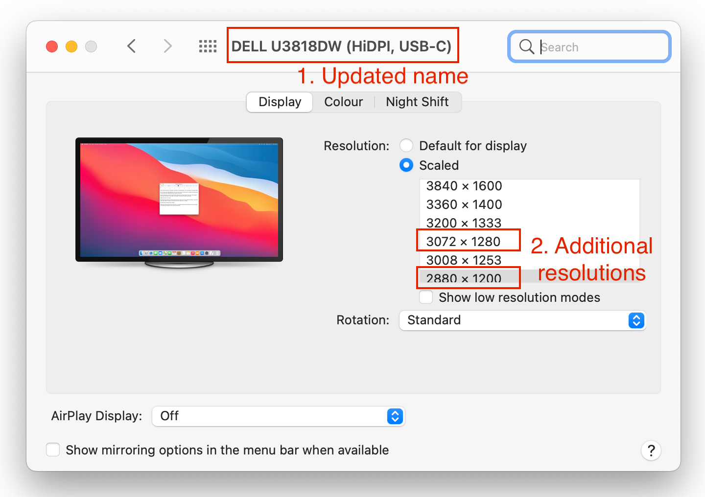

# Display Overrides for macOS

This is for display overrides to make (my) monitors work better on macOS.

Goals:

- Force HiDPI modes for screens that are not supported (by macOS)
- Force picture modes on misbehaving screens
- Fix displays detected as TVs
- Make sure Night Shift works on external displays

## Usage

1. Create overrides (`DisplayVendorID-*/DisplayProductID-*.plist`) or use the existing ones
2. Open Terminal and run `./install.sh` from the project folder
3. Reboot

After rebooting, the "Display" system preferences should show an updated display name in the title bar and if scaled resolutions are shown (option-click on "Scaled"): additional resolutions are available. 

See screenshot below from my Dell U3818DW.



The highlighted resolutions correspond to a scaling of 80% respectively 75% of the native screens resolution.

## Notes

- Since macOS Mojave we no longer seem to need RGB edid overrides, they are ineffective

## Dumping display EDID

Create a dump for each display connected to your Mac.

```bash
n=0; \
ioreg -lw0 | grep "IODisplayEDID" \
	| while read line; do \
		(( n++ )); \
		name=display-${n}.edid; \
		sed "/[^<]*</s///" <<<"$line" | xxd -p -r > $name; \
		echo "Created $name"; \
	done
```

## Resources

- [Display Override PropertyList File Parser and Generator with HiDPI support](https://comsysto.github.io/Display-Override-PropertyList-File-Parser-and-Generator-with-HiDPI-Support-For-Scaled-Resolutions/)
- [edid-decode](https://git.linuxtv.org/edid-decode.git/)
- [A Guide To Creating Scaled Resolutions in MacOS](https://github.com/bbhardin/A-Guide-to-MacOS-Scaled-Resolutions)